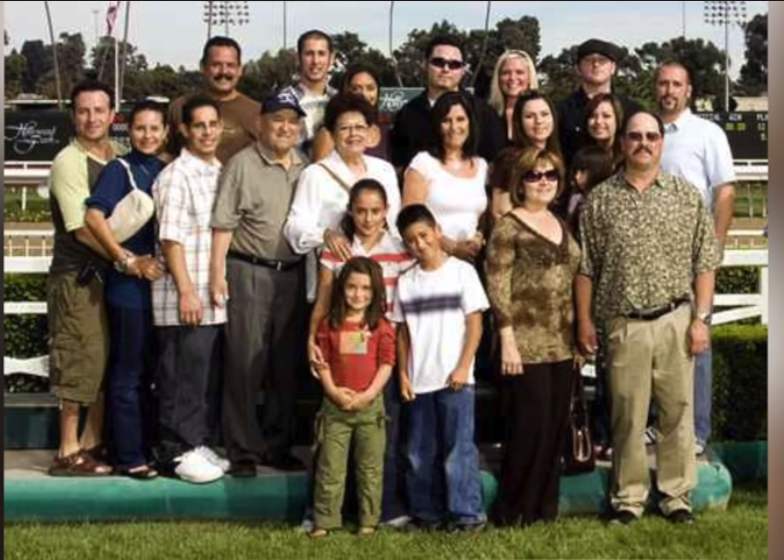
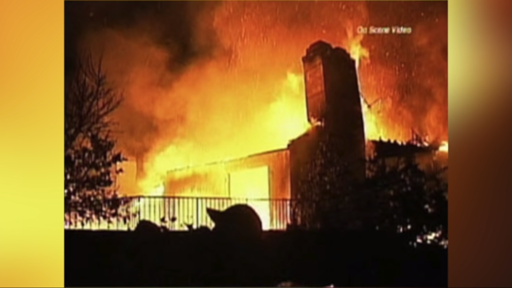
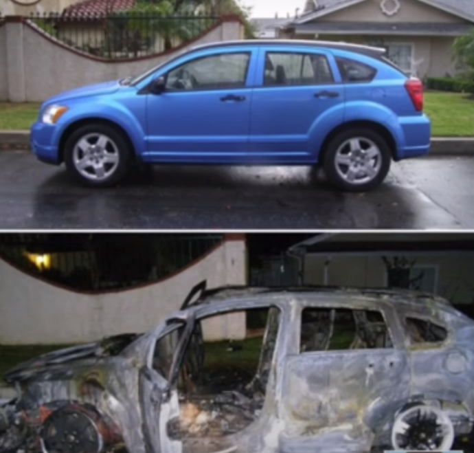
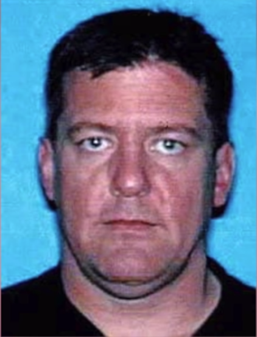

Title: Asesinato en navidad  
Date: 2020-12-24 23:00  
Category: criminales  
Slug: brucepardo  
Author: Zarco Dionisio  
Summary: La historia de Bruce Pardo y la masacre de Covina

El 24 de diciembre del año 2008, en Covina, California,  La Joseph y Alicia Ortega se encontraban festejando la noche buena en compañía de sus hijos y de las familias de sus hijos, en total un aproximado de 25 personas estaban presentes en la casa esa noche, lo cual no era extraño, puesto que las reuniones familiares en este lugar eran frecuentes.

<figure align=center>
    <figcaption>Familia Ortega</figcaption>
</figure>

Todo apuntaba a ser un festejo normal, con música, comida y juegos de póquer. Aproximadamente a las 23:30 horas, sonó el timbre de la casa, Katrina Yuzefpolsky de 8 años fue la encargada de abrir la puerta, al abrirla su cara se ilumino pues del otro lado se encontraba una persona con un disfraz de Santa Claus cargando un par de regalos, sin embargo esa felicidad pronto se convertiría en desesperación pues de las cajas de regalos el perpetrador saco dos pistolas 9mm semiautomáticas y comenzo a disparar, hiriendo a Katrina en la cara.

El fuego indiscriminado siguió por un tiempo, causando la muerte de Sylvia Ortega, Alicia Ortega y Joseph Ortega. Al detener el fuego, el perpetrador extrajo de una de las cajas de regalo un lanzallamas y gasolina, con los cuales prosiguió a prender fuego al hogar de los Ortega.

El fuego causo que los Ortega intentaran huir, algunos resultando heridos, sin embargo los mas desafortunados no lograron salir con vida del incendio.

<figure align=center>
    <figcaption>Incendio en la Residencia Ortega</figcaption>
</figure>

Para cuando la policía arribo, el perpetrador con el disfraz de Santa Claus ya no se encontraba presente. Al explorar la casa, se encontraron varios cuerpos ya irreconocibles por el daño provocado por el fuego.

Durante el interrogatorio a los sobrevivientes, se encontró que Leticia fue capaz de identificar al perpetrador a pesar de su disfraz, Su nombre: Bruce Jeffrey Pardo, ex esposo de su hermana, Sylvia Ortega con la cual estaba pasando por el proceso de divorcio y estaba obligado a pagarle la cantidad de $1,785 dolares mensuales.

Después del ataque, Bruce escapo en un Dodge Caliber rentado, rumbo a casa de su hermano, sin embargo antes de llegar a dicha casa, bruce abandono el vehículo, depositando en el el disfraz de Santa Claus. Una vez en la casa de su hermano, Bruce procedió a  suicidarse.

En total 9 personas fallecieron en el ataque, 3 a causa de los disparos y 6 mas debido al fuego. La investigación encontró que Bruce tenia planes para escapar y eliminar la evidencia, uno de ellos siendo una trampa explosiva en el vehículo de renta, el cual explotaría cuando el disfraz fuese removido de el, lo que ocurrió, afortunadamente sin herir a nadie.

<figure align=center>
    <figcaption>Vehiculo Rentado</figcaption>
</figure>

La autopsia revelo que Bruce tenia horribles quemaduras de tercer grado, estas tan intensas que parte de su disfraz se había fundido en su cuerpo. Esta es la posible causa por la que opto por suicidarse, ya que no parecía estar en sus planes iniciales.

<figure align=center>
    <figcaption>Bruce Jeffrey Pardo</figcaption>
</figure>