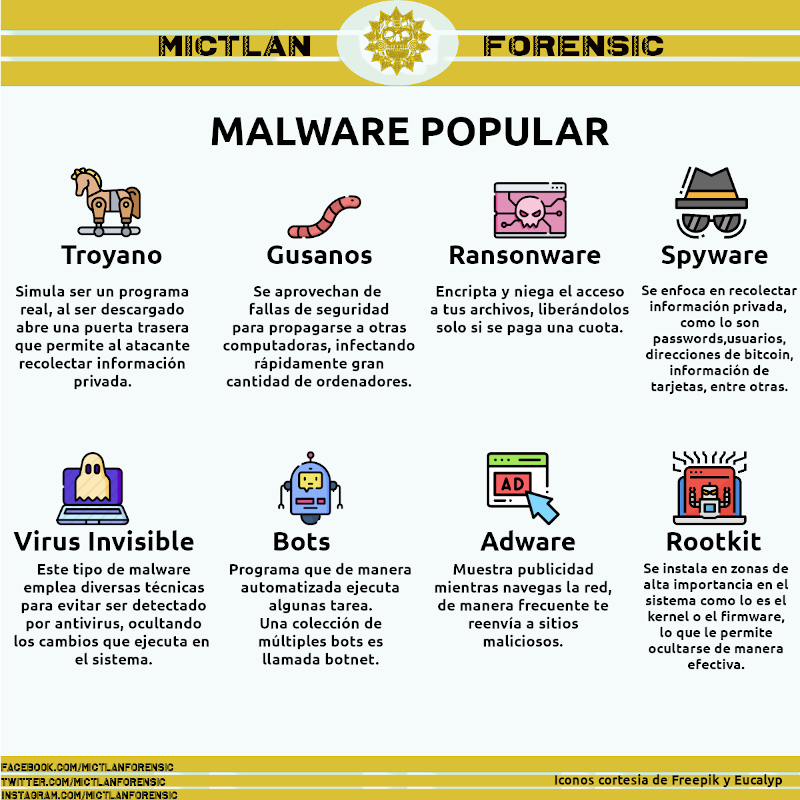

Title: Tendencias en Malware  
Date: 2020-12-18 23:00  
Category: ciberseguridad  
Slug: tendencias en malware  
Author: Zarco Dionisio  
Summary: Malware usado frecuentemente en ataques cibernéticos.

# Tendencias en Malware

La situación que se ha vivido a lo largo del año debido a  Covid-19 ha provocado una aceleración en la adopción de servicios digitales, desafortunadamente otra consecuencia ha sido el incremente en ataques cibernéticos. Los daños que el cibercrimen provoca se estima que llegaran a los $6 trillones de dolares anules para el 2021.

Tan solo en México se estima que suceden 10, 000 ciberataques al mes, siendo las instituciones tanto publicas como privadas el principal objetivo de estos.

El 22.57% de estos ataques son del tipo “Ransomware”, tipo de ataque que consisten en encriptar la información de un sistema, haciéndola inaccesible para el usuario a menos que se pague  una suma de dinero.

<figure>    <figcaption>Fig.1 - Ransomware "Cerber"</figcaption></figure>

A pesar de que las estadísticas nos indican que la taza de infección por Ransomware va en disminución, aun casi el 50% de las victimas pagan el rescate. La causa de que varias compañías eligen pagar el rescate es principalmente debido a que el tiempo muerto que pasan sus ordenadores al estar infectados, resulta mas costoso que el precio a pagar.

<figure>    <figcaption>Fig.2 - Randomware mas populares.</figcaption></figure>

Se estima que el 92% del malware se recibe vía correo electrónico, esto mediante avanzadas técnicas de phishing y sus variantes. En México un técnica común es la de mandar a las victimas imitaciones de paginas de **gobierno**, usualmente pidiéndoles que llenen algún formulario prometiendo a cambio apoyos económicos.

Sin mas, a continuación se deja un gráfico donde se explican algunos de los malware mas comunes y sus efectos.

